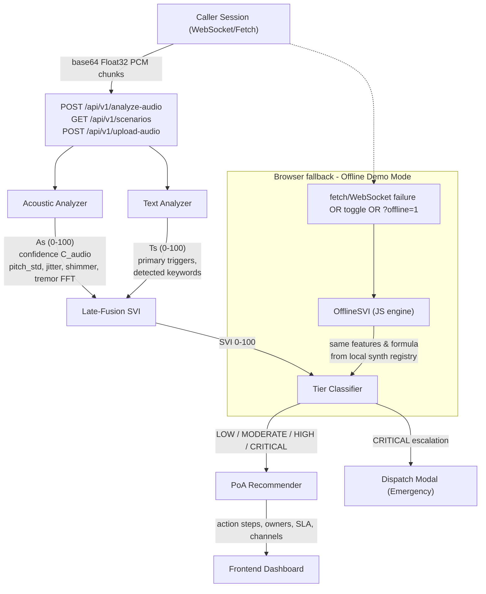
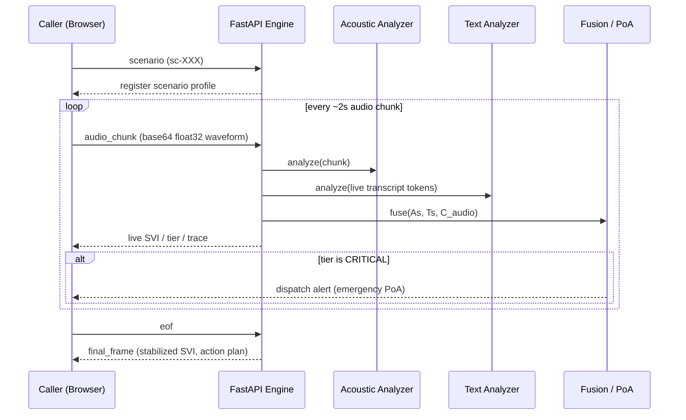
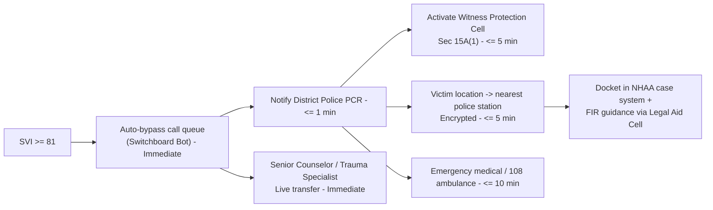

# NIDAAN SVI Engine — System Architecture

**NIDAAN** (Hindi: "root cause") is a real-time **Speech & Voice Intelligence (SVI) Risk Engine** for the National Helpline Against Atrocities (NHAA, 14566). It fuses **acoustic distress features** and **lexical suicide/abuse markers** into a single **Stress-Vulnerability Index (SVI, 0–100)** that drives tiered **Plan of Action (PoA)** dispatch under the *PoA Act, 1989*.

## 1. High-Level Ingress Pipeline

```
 Caller dials 14566
       |
       v
 Complex Event Processor  <-- WebSocket (native mic) / File Upload (audio replay)
       |
       +-----------+-------------------+---------------------+
       v           v                   v                     v
  Acoustic      Text                   Fusion             Plan-of-Action
  Analyzer      Analyzer               Engine             Recommender
  (pyin,        (lexicon 11           (late fusion         (tier-keyed
   jitter,       categories,           weighted             action steps,
   shimmer,      severity              confidence)          PoA-1989 /
   tremor FFT)   weights)                                   IPC sections)
       |           |                     |                        |
       |           |   SVI = C*(0.4*As+0.6*Ts)+(1-C)*Ts          |
       +--+---------+---------------------+-----------------------+
          v                               v                       v
   WebSocket live push          Tier (LOW/MODERATE/HIGH/         Dispatch modal
   (audio_chunk, text_token,    CRITICAL) badge                  on CRITICAL
    scenario, eof)  <---------------------------------+              |
          v                                             |            v
   Browser (Live Trace, waveform, telemetry)  <---------+   Police/Medical dispatch
                                                                 (auto-bypass queue,
                                                                  PCR, Witness Protection)
```

## 2. Component Dataflow (Mermaid)



## 3. Session Sequence



## 4. Late-Fusion Matrix

The engine deliberately uses **late fusion** so acoustic stress and lexical lethality
stay independently auditable, then combine under audio confidence:

```
SVI = C_audio * (0.4 * As + 0.6 * Ts) + (1 - C_audio) * Ts
```

| Input | Basis | Feature set |
|---|---|---|
| `As` (acoustic score) | 0.40 | pitch instability (pyin `pitch_std`), jitter, shimmer, tremor (FFT in 3–8 Hz band), voiced silence ratio |
| `Ts` (text score) | 0.60 | 10-category Hinglish lexicon (physical threat, land arson, social boycott, caste abuse, suicidal ideation, sexual violence, property damage, family threat, economic deprivation, exclusion), severity weights, intensifier amplification |
| `C_audio` (confidence) | — | voiced-frame ratio and stability: `As` is trusted when speech is present; on silence/noise, score decays to `Ts` |

**Calibrated tier bands (identical in backend and browser offline engine):**

| SVI range | Tier | Immediate posture |
|---|---|---|
| 0–30 | **LOW** | Routine inquiry follow-up (SMS) |
| 31–60 | **MODERATE** | District Welfare Officer callback ≤ 24 h, 48 h safety recheck |
| 61–80 | **HIGH** | Senior counselor live transfer, tele-medical referral, DSP-level escalation |
| 81–100 | **CRITICAL** | Emergency modal: bypass queue, PCR + ambulance, Witness Protection (Sec 15A) |

## 5. PoA Act 1989 Escalation Flow



Each tier maps to statutory anchors: `Sec 3(1)(r)`, `Sec 3(2)(v)`, `Sec 4`, `Sec 6`, `Sec 8`,
`Sec 15A(1/2)`, `Sec 18A`, `Sec 21(2)`, and `Sec 22` — with owner, SLA, and delivery channel
per step (see `backend/poa_recommender.py`).

## 6. Offline Demo Mode (Browser Fallback)

When the API is unreachable (server down, runtime network block, manual toggle, or `?offline=1`),
the frontend switches to an embedded **JS SVI engine** (`frontend/js/offline_data.js` + `app.js`)
that mirrors backend contracts: same 10-category text lexicon, same AC-autocorrelation pitch
(30 ms frame / 10 ms hop), jitter/shimmer/tremor, same fusion formula and tier bands, and the
same tier-keyed action plans. 15 calibrated scenarios replay the full LOW→CRITICAL spectrum end-end,
so the proof-of-concept demo is fully self-contained with identical tier math.

## 7. Repository Map

| Path | Role |
|---|---|
| `backend/app.py` | FastAPI: WS/HTTP ingress, session orchestration |
| `backend/acoustic_analyzer.py` | Acoustic distress feature extraction |
| `backend/text_analyzer.py` | Lexicon scoring + trigger/keyword extraction |
| `backend/poa_recommender.py` | Tier-keyed Plan-of-Action steps |
| `backend/svi_core.py` | Fusion formula, tier bands, confidence |
| `frontend/js/app.js` | Dashboard, live trace, offline SVI engine, dispatch modal |
| `frontend/js/call_simulator.js` | WebRTC mic capture + synthetic distress caller |
| `frontend/js/offline_data.js` | Offline scenario registry (15 calibrated cases) |
| `tests/` | 55-case regression suite (SVI engine + zero-error/statute anchors) |